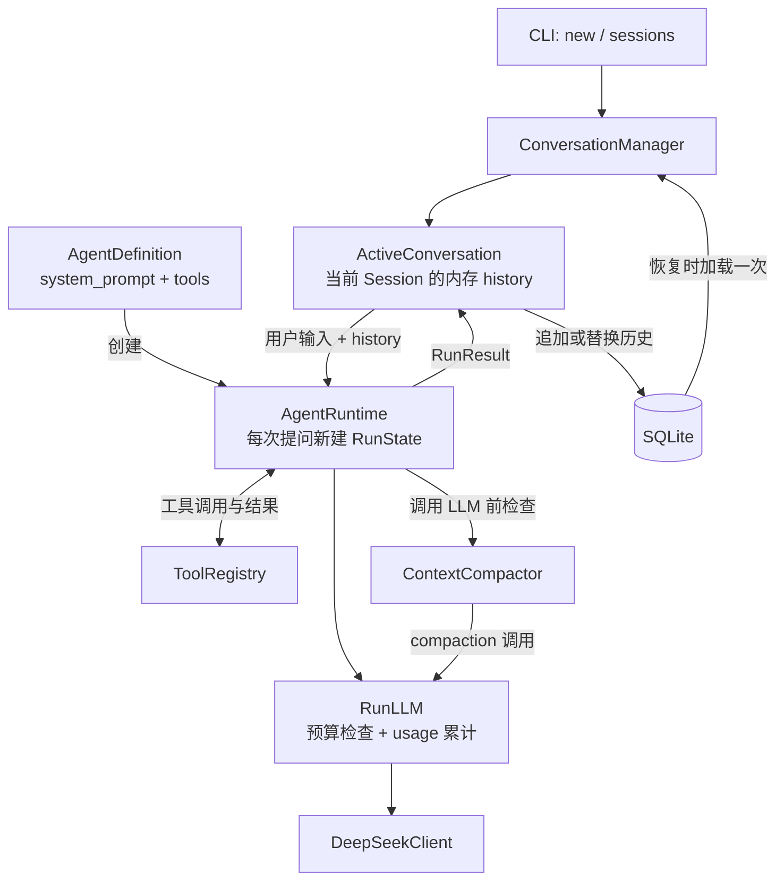

# mini_agent

从零实现的最小 ReAct 风格 Agent，使用真实 DeepSeek Chat Completions 接口，
支持工具调用、连续追问、独立 Session 和滚动摘要。核心流程不依赖 Agent 框架，
工具 Schema 使用 Pydantic，持久化使用 SQLite。

## 1. 运行方式

需要 Python 3.12+ 和 DeepSeek API Key。在项目根目录执行（PowerShell）：

```powershell
python -m venv .venv
.venv\Scripts\python.exe -m pip install -e ".[dev]"
if (-not (Test-Path .env)) { Copy-Item .env.example .env }
```

编辑 `.env`，填写实际密钥和支持工具调用的模型名称：

```dotenv
API_KEY=your-api-key
BASE_URL=https://api.deepseek.com
MODEL=your-model-name
```

客户端通过 `load_dotenv()` 加载配置，系统环境变量优先于 `.env`。不要提交真实密钥。

```powershell
# 新建对话，可连续输入问题
.venv\Scripts\mini-agent.exe new

# 列出历史 Session，输入编号后继续对话
.venv\Scripts\mini-agent.exe sessions

# 不记录本次会话的执行 trace
.venv\Scripts\mini-agent.exe new --no-trace
```

输入 `/exit` 或在输入时按 `Ctrl+C` 退出。首次非空消息到来时才创建 Session。
本地 Owner ID 自动生成，两个窗口分别 `new` 即得到独立 Session；不支持同时写入同一个 Session。

默认在项目根目录保存 `config.json`、`sessions.db` 和 `traces/<run_id>.json`，运行数据默认被 Git 忽略，
仅下方链接的示例 trace 纳入版本库。
Trace 可能包含对话原文和工具结果，不会自动清理。

## 2. 系统设计



应用复用 Client、Runtime、Registry、Compactor 和 Store；Session 历史只属于各自的
ActiveConversation。每次提问创建新的 RunState、RunLLM 和 Run ID。

`ModelConfig` 控制 chat/compaction 的单次输出（默认 2,048/4,096 tokens）和重试次数；
`RuntimeConfig` 控制 `max_steps=8` 以及 chat/compaction 的 Run 级软预算（默认 50K/800K）。
两类调用分别累计，最终 `token_usage` 为二者之和。

Agent Loop：接收输入 → 调用 LLM → 返回答案，或执行工具并追加结果 → 继续调用 LLM。
使用原生 `content` / `tool_calls` 解析响应，不保存模型内部思考。

每个工具包含名称、描述、Pydantic 参数模型和执行方法，由 Registry 注册并生成 Schema，
LLM 自主选择调用：

- `calculator`：参数 `operation / a / b`，支持加减乘除，除零返回错误。
- `search`：参数 `query`，固定返回 `"mock result"`。
- `weather`：参数 `location`，返回模拟天气，不提供实时数据。

## 3. Memory：召回时机与放置方式

Memory 是当前 Session 的有效历史及可选摘要，不使用向量检索，也不跨 Session 召回。

- **新建对话**：history 为空，不读取历史。
- **恢复 Session**：校验 Owner 后，从 SQLite 加载一次历史到内存。
- **连续追问**：直接使用内存 history，不逐轮读取 SQLite。
- **工具执行后**：将调用与结果追加到当前 Run，供下一次 LLM 调用使用。
- **保存成功后**：更新内存 history，供下一轮提问使用。

每次请求的消息顺序为：

```text
system prompt
历史摘要（如有，作为 assistant 消息）
最近未压缩的完整 user / assistant / tool 轮次
当前用户输入及本轮已产生的 assistant / tool 消息
```

system prompt 仅在请求时注入，不持久化；摘要是历史资料，不是 system 指令。
内部标记 `_kind`、`_run_id` 发送前移除，tools Schema 通过独立的 `tools` 参数传入。
Trace 不参与 memory 召回。

## 4. Context 压缩与保存

每次正常 LLM 调用前，将 messages（包含 system）与 tools Schema 序列化，
以字符数 `/ 4` 估算 token 数。默认按 **1M 上限、70% 触发**；
这只是配置假设，需按模型调整，估算不能保证不超限。

压缩采用“滚动摘要 + 最近完整轮次”：

1. 保留最近 4 轮和当前 Run，工具调用与结果不能拆开，保留轮数不会自动减少。
2. 用同一个 LLM 将“已有摘要 + 更早轮次”合并为一条新摘要。
3. 保留目标、约束、关键事实、工具结果和未完成事项；摘要默认最多 8,000 字符。
4. 检查摘要有效、上下文确实变短且低于预算，再替换运行中的旧历史。

配置由 `AgentDefinition.create_runtime(runtime_config=RuntimeConfig(...),
context_policy=ContextPolicy(...))` 传入。
摘要调用不占用 Agent 的 `max_steps`。没有可压缩旧轮次、预算不足或摘要失败时停止本轮，
不写回历史，也不更新会话内存。

保存规则：

- **未压缩**：只追加本轮 `new_messages`。
- **已压缩**：一个事务内删除该 Session 的全部旧消息，再插入“摘要 + 保留轮次 + 本轮消息”。
- **提交成功后**才更新内存；数据库失败回滚，不影响其他 Session。

SQLite 保存的是有效上下文，不是完整原文档案；被摘要覆盖的细节可能丢失。
Trace 独立保留，不随压缩删除，也不会自动用于找回这些细节。

每个 trace 事件保存当时累计的 `chat_token_usage`、`compaction_token_usage`、
`token_usage` 和 `usage_complete`。模型事件另保存本次请求的 usage；`run.end`、
RunResult 和 CLI 输出最终总量。成功响应缺少 usage 时仍保留输出，但将统计标为不完整。

## 架构设计题

以下内容是面向更完整 Agent 系统的扩展设计；event log 检索、混合 Memory 召回、
Goal Capsule 和 Session mailbox 尚未包含在当前最小实现中。

### 模块一：Context / Performance

#### Session 连续聊了 200 轮，context 快满了，如何压缩并保证流畅？

在使用量达到窗口的 60%–70% 时提前触发增量压缩。预留足够空间给下一轮用户输入、模型输出和工具结果。

压缩后的上下文分为四部分：

1. **固定指令**：系统规则、角色设定和安全边界，保持原文，不参与压缩。
2. **会话契约**：当前目标、硬性约束、用户要求、已确认的偏好。
3. **工作状态**：当前计划、完成进度、待办事项、关键决策、失败尝试及其原因。
4. **近期对话**：保留最近 5–10 轮原文，维持语气、指代和局部讨论的连续性。

历史消息不会直接删除，而是保存在外部持久化的 event log 中。压缩摘要中的关键事实、决策和工具结果应关联原始消息 ID，模型需要细节时可以重新检索。

### 模块二：Memory

#### 用户问了一个半个月前问过的问题，Agent 如何合理召回？

首先要判断当前问题是否需要使用历史记忆，而不是每次都检索全部 memory。

如果需要，我会先使用 Rewriter 对当前问题进行查询改写，补充上下文中的省略信息和实体。

然后进行混合召回，同时使用：

- 向量语义检索；
- BM25 或关键词检索；
- 实体匹配；
- 时间范围；
- 用户、项目和 session scope；
- 记忆的重要性和用户反馈。

召回结果经过合并、去重后，再由 Reranker 根据与当前任务的相关性、时间有效性、来源可信度和用户反馈进行重排与过滤，判断记忆是否过期。最后只向模型注入完成当前回答所需的最小记忆。

完整流程可以概括为：

```text
判断是否需要记忆
→ Query Rewrite
→ 混合召回
→ 合并去重
→ Rerank
→ 时效性与冲突检查
→ 注入最小必要记忆
→ 生成答案
```

### 模块三：Task

#### 长程任务中模型可能忘记目标，如何解决？

我会把任务目标维护成一个短小、结构化并始终位于上下文顶部的 Goal Capsule，例如：

```yaml
objective:
success_criteria:
constraints:
current_phase:
completed:
next_action:
```

模型每次规划或调用工具之前都需要读取这个对象，并根据成功标准检查当前动作是否仍然服务于原始目标。

这种方案成本低、占用的 token 少，而且能够持续提醒模型当前目标、硬性约束和下一步行动。

它的风险是 Goal Capsule 可能在任务执行过程中被模型错误修改，造成目标漂移。

### 模块四：Tool / Session Runtime

#### Session busy 时收到新用户消息或异步工具完成事件，Runtime 应如何处理？

我会为每个 session 建立一个串行处理的 mailbox。用户消息、工具完成事件、定时事件和取消请求都先写入 event log，再由 session runtime 按顺序处理，避免多个线程同时修改 session state。

每个事件都要携带：

```text
session_id
run_id
branch_id
event_id
correlation_id
sequence
```

其中 `run_id` 和 `branch_id` 表示事件在时间上和任务空间上属于哪一次执行，`correlation_id` 用来关联原始工具调用。

如果异步工具完成事件属于当前 run：

- 先持久化工具结果；
- 如果模型正在生成，不立即并发启动第二个 Agent loop；
- 将结果标记为 pending；
- 到达安全点后，把工具结果与等待中的用户消息一起交给下一轮模型处理。

如果新用户消息只是补充信息，可以作为 steering input 在安全点注入；如果用户改变目标、要求停止或纠正当前操作，则应拥有更高优先级，可以取消当前生成或阻止后续工具执行。

### 模块五：Agent Runtime 架构对比

#### Claude Code 的工具输出与 OpenAI-compatible function calling 有什么不同？

Anthropic 使用的是 content block 结构。Assistant 消息中可以同时包含文本和 `tool_use` block，工具执行结果则以 `tool_result` block 放在下一条 user 消息中，通过 `tool_use_id` 与调用关联。

```text
assistant:
  text
  tool_use

user:
  tool_result
  text
```

它没有单独的 `tool` 或 `function` role，而是把工具调用和结果直接融入 user/assistant 消息。`tool_result.content` 还可以包含文本、图片等不同类型的内容块，因此更适合多模态结果和 Agent 的流式执行过程。

OpenAI-compatible Chat Completions 通常采用：

```text
assistant.tool_calls
tool:
  tool_call_id
  content
```

它使用独立的 `tool` role 返回结果，协议结构更加标准化，拥有较好的 SDK、网关和模型兼容性，因此国内模型很容易通过兼容这一接口降低接入成本。

两者的取舍是：

- Anthropic content block 表达能力更强，文本、工具调用和多模态结果可以自然组合，但消息顺序和 block 解析要求更严格。
- OpenAI-compatible 接入简单、生态成熟，但许多兼容实现只支持基础的 JSON 参数和文本工具结果，对并行调用、多模态结果、增量输出和错误语义的支持并不完全一致。

## AI Prompt 与问题解决记录

- [AI Prompt 与开发思路](docs/AI_PROMPTS.md)：核心设计思路与开发过程中使用的 Prompt。
- [问题解决运行记录（JSON）](traces/9aad315a-ef79-48c9-a9bf-fca4b8d1c11f.json)：
  用户输入 `5+20*1`，Agent 先调用乘法工具得到 `20`，再调用加法工具得到 `25`，
  最终返回答案。记录包含用户 Prompt、assistant 输出、工具参数、执行结果和 Run 状态，
  不包含 system prompt 或模型内部思考。
